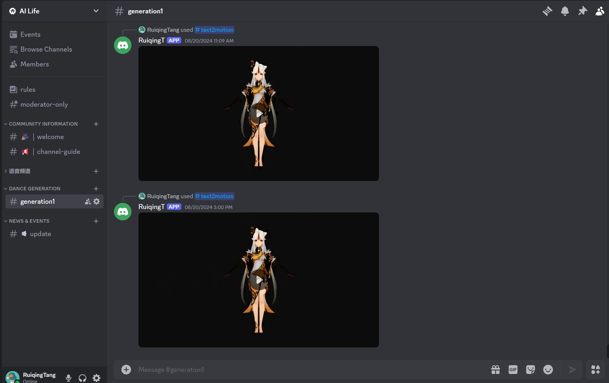

# Algo-reproduce

This repository documents all open-source algorithms that I have reproduced up to this point, as well as the modifications I have made.

Due to there are many algorithms involved, I have placed the more effective algorithms and tool-oriented algorithms at the forefront, with special annotations provided.

⭐ If you find this repository useful to your research or work, it is really appreciated to star this repository.

✉️ Any additions or suggestions, feel free to contribute and contact [tangruiqing123@gmail.com](tangruiqing123@gmail.com).

# Table of Contents

## [text to 3d human motion](#myanchor1)

## [music to 3d human dance](#myanchor2)

## [3d human motion capture](#myanchor3)

## [else](#myanchor4)

Currently, I have integrated text2motion and music2dance into the 🫨Discord community. Due to the unstable server magic and algorithm inefficiency, it is temporarily unavailable for public access. I will continue to update and expect to go live by the end of October.

|               Task                |    Status     |                           Roadmap                            |
| :-------------------------------: | :-----------: | :----------------------------------------------------------: |
|            Text2Motion            |  ⛳supported   | Multi-role Selection Customize Roles vmd&fbx Download Link Fix Physical Effects |
|            Music2Dance            |  ⛳supported   | Multi-role Selection Customize Roles vmd&fbx Download Link Fix Physical Effects |
|     Singing Voice Conversion      | 👨‍💻 developing |                            · · ·                             |
| LLM Role Play (Voice & Text Chat) | 👨‍💻 developing |                            · · ·                             |
|          Motion Capture           | 👨‍💻 developing |                            · · ·                             |

Here are some result demonstrations.

## ⭐You can find all the results in this [directory](https://github.com/RuiqingTang/Algo-reproduce/tree/main/assets).

## text to 3d human motion

## 3d human motion capture

## else

