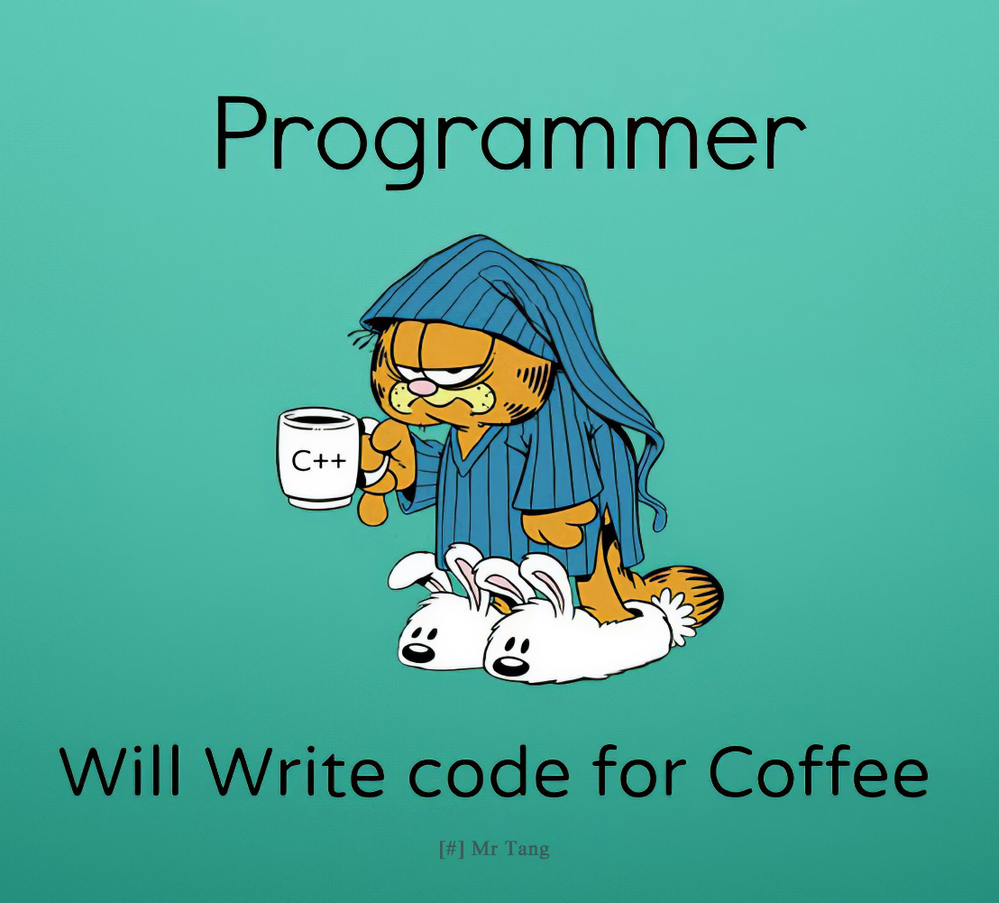

# Algo-reproduce

This repository documents most open-source algorithms that I have reproduced up to this point, as well as the modifications I have made.

Due to there are many algorithms involved, I have placed the more effective algorithms and tool-oriented algorithms at the forefront, with special annotations provided. Because of my limited time and capabilities, I am unable to conduct exhaustive tests on all algorithms, so there may be some shortcomings. Feedback is welcome💡.

 <span id='algodir'>Most ALGOs</span>. Some are not included in this image but will be mentioned later.


⭐ If you find this repository useful to your research or work, it is really appreciated to star this repository.

✉️ Any additions or suggestions, feel free to contribute and contact [tangruiqing123@gmail.com](tangruiqing123@gmail.com).

# 🔥News

- `2024.09.14` adjusted the layout and modified some contents.



# Table of Contents

## [Tools](#tools)

## [text to 3d human motion](#myanchor1)

## [music to 3d human dance](#myanchor2)

## [3d human motion capture](#myanchor3)

## [other](#myanchor4)

Currently, I have integrated text2motion and music2dance into my 🎮**Discord** community. Due to the unstable server magic and algorithm inefficiency, it is temporarily unavailable for public access. I will continue to update and expect to go live by the end of October.

|               Task                |    Status     |                           Roadmap                            |
| :-------------------------------: | :-----------: | :----------------------------------------------------------: |
|            Text2Motion            |  ⛳supported   | Multi-role Selection<br>Customize Roles<br />vmd&fbx Download Link<br />Fix Physical Effects |
|            Music2Dance            |  ⛳supported   | Multi-role Selection<br/>Customize Roles<br />vmd&fbx Download Link<br />Fix Physical Effects |
|     Singing Voice Conversion      | 👨‍💻 developing |                            · · ·                             |
| LLM Role Play (Voice & Text Chat) | 👨‍💻 developing |                            · · ·                             |
|          Motion Capture           | 👨‍💻 developing |                            · · ·                             |

Here are some result demonstrations.


<center>text2motion</center>

https://github.com/user-attachments/assets/cfa95af2-3e2a-40c5-babe-3644feec0d3a

<center>music2dance</center>

https://github.com/user-attachments/assets/73b8c362-4b7b-494f-bbc8-d5a0b4b0841a

## ⭐You can find all the results in this [directory](https://github.com/RuiqingTang/Algo-reproduce/tree/main/assets).

## <span id='tools'>Tools</span>

1. **smpl2fbx**

   https://github.com/softcat477/SMPL-to-FBX
   https://www.winehq.org/
   Thanks to the authors for releasing the code. I can convert the SMPL pose parameters into FBX. If you are not familiar with SMPL, you can refer to [the official website](https://smpl.is.tue.mpg.de/). If you wish to delve deeper, you can also visit this [website](https://smpl-x.is.tue.mpg.de/). However, there is an issue with the FBX I converted; its initial position is not at the origin of the three-dimensional coordinate system.

   

   I addressed this issue through some post-processing work. I executed the following command in Blender:

   ```python
   import bpy
   obj = bpy.context.object
   obj.location = (0, 0, -0.3)
   obj.rotation_euler = (3.1, 0, 0)
   ```

   The final result is as follows:

   

2. **smpl2vmd**

   https://github.com/rongakowang/MMDMC **(ECCV, 2024)**

   Thanks to the authors for releasing the code. I can convert the SMPL pose parameters into VMD. To be precise, the model used is SMPL+H. SMPL+H includes additional hand information compared to SMPL. I set all these additional hand information to 0, and the program still runs correctly.

   Thanks to the [developer](https://github.com/UuuNyaa) of mmd_tools（[official website](https://mmd-blender.fandom.com/wiki/MMD_Tools) | [github pages]( https://github.com/UuuNyaa/blender_mmd_tools)). There are still some issues with *IK Toggle*, and I look forward to your subsequent fixes.

3. **fbx2vmd**

   I'm very sorry, I can no longer find the repository of the author. I found this [repository](https://github.com/tomtomtong/FBXtoVMD), but I haven't verified it yet.

   Through this project, combined with [Unity 2020.3.48f1](https://unity.com/cn/releases/editor/whats-new/2020.3.48#installs), I can convert FBX to VMD. Whether it's an FBX converted from smpl or an FBX downloaded from mixamo, it can all be converted using this tool. However, this conversion is lossy and often results in abnormal movements. Additionally, not all FBX files are supported, leading to issues with bone binding errors.

## <span id='myanchor1'>text to 3d human motion</span>

1. **stmc✨**

   **:crystal_ball: Code:** https://github.com/nv-tlabs/stmc 

   **:volleyball: Projects Page:** https://mathis.petrovich.fr/stmc/ 

   **📚 Paper:** https://arxiv.org/abs/2401.08559 **(CVPR, 2024)**

   **📝 Note:** In fact, STMC is the algorithm that I consider to be the most effective at present. However, due to its stringent requirements for prompts (must include descriptions of the actions, the body parts involved, the duration of the actions, they are separated by "|". ) , from an engineering perspective, I had to abandon it, or integrate a LLM to modify the prompts to meet the requirements. In my tests (Prompts are generated by GPT-4) , I disregarded the stringent requirements for prompts, ensuring only that their format was correct. This results in its performance not being as optimal as desired.

   **📀 Results:** You can check the demo result and my test results [here](https://github.com/RuiqingTang/Algo-reproduce/tree/main/assets/text2motion/stmc).

2. **FlowMDM✨**

   **:crystal_ball: Code**: https://github.com/BarqueroGerman/FlowMDM

   **:volleyball: Projects Page:** https://barquerogerman.github.io/FlowMDM/

   **📚 Paper:** https://arxiv.org/abs/2402.15509 **(CVPR, 2024)**

   **📝 Note:** Personally, I find this algorithm to be excellent. I have decided to integrate it into my Discord community to replace the current 	algorithm（[SATO](#sato)）by September 30, 2024. I have made some modifications to this algorithm. 

   Firstly, I need to address the input format. In FlowMDM, the input data is a JSON file containing two fields: lengths and text. 

   eg:

   ```json
   {
       "lengths": [99,99],
       "text": ["backflip","punch in the air"]
       }
   ```

   I believe this can be integrated with a LLM to process user inputs, but I ultimately decided to design a smaller model (encoder) myself as the input to the FlowMDM model. Of course, I may need to retrain the model, but I believe the time spent is worthwhile.

   Secondly, considering the issue of algorithm efficiency, it currently takes a very long time. In the example above, it takes 43 seconds to export the FBX. This forces me to find ways to improve it. Since FlowMDM is based on [MDM](#mdm), and MDM recently open-sourced a diffusion model that only requires 50 steps, compared to the current 1000 steps, which can significantly reduce the time consumption. I will use this as a point of improvement. 

   Additionally, the model outputs JOINT poses, which need to be converted into SMPL. Fortunately, previous researchers have provided a *joint2smpl* script. However, this step is actually very time-consuming. I examined its source code and found that the issue lies with the optimizer. The author used the *LBFGS* optimizer, which incurs significant computational overhead. I replaced it with *Adam*, which, although it does not achieve the same final performance as *LBFGS* (prone to Z-fighting issues), is much faster. Another solution is to set fewer optimization iterations, I changed it from 150 to 5. I haven't precisely tuned this data; I only plotted the loss curve, took a quick look, and then made the change.

   **📀 Results:** You can check the demo result and my test results [here](https://github.com/RuiqingTang/Algo-reproduce/tree/main/assets/text2motion/FlowMDM).

3. **<span id='sato'>SATO</span>✨**

   **:crystal_ball: Code:** https://github.com/sato-team/Stable-Text-to-Motion-Framework

   **:volleyball: Projects Page:** https://sato-team.github.io/Stable-Text-to-Motion-Framework/

   **📚 Paper:** https://arxiv.org/abs/2405.01461 **(ACM MM 2024)**

   **📝 Note:**  This algorithm can only generate some very simple motion. But before  learning about FlowMDM, it was relatively better. I also I replaced the *LBFGS* with *Adam* . 

   **📀 Results:** You can check the demo result and my test results [here](https://github.com/RuiqingTang/Algo-reproduce/tree/main/assets/text2motion/SATO).

4. **StableMoFusion✨**

   **:crystal_ball: Code:** https://github.com/h-y1heng/StableMoFusion

   **:volleyball: Projects Page:** https://h-y1heng.github.io/StableMoFusion-page/

   **📚 Paper:** https://arxiv.org/abs/2405.05691 

   **📝 Note:**  This algorithm is an accelerated work of text2motion. Its inference speed is incredibly fast, taking less than 1 second on RTX 6000. Because it only requires 10 steps of diffusion, compared to MDM (1000 steps), it has been reduced to 1/100. Of course, this is not a simple DDIM. For specific technical details, please refer to the paper. After reading the paper and conducting tests, I discovered an issue. This algorithm strictly ensures the motion denoising trajectory closely aligned with the timestep. This can result in continuous motion throughout the duration. For example, if the input text is "A person does a backflip" with a duration of 4 seconds, according to common experience, we know that performing a backflip typically takes less than 4 seconds. This leads to the algorithm producing a result where the person is repeatedly doing backflips, and even when the duration ends, the person is still in the air. So I plan to modify its text encoder-related modules in the future (maybe a thousand years later, haha). Additionally, I have abandoned the foot-skate improvement because it is too time-consuming.

   **📀 Results:** You can check the demo result and my test results [here](https://github.com/RuiqingTang/Algo-reproduce/tree/main/assets/text2motion/StableMoFusion).

5. **PriorMDM**

   **:crystal_ball: Code:** https://github.com/priorMDM/priorMDM

   **:volleyball: Projects Page:** https://priormdm.github.io/priorMDM-page/

   **📚 Paper:** https://arxiv.org/abs/2303.01418 **(ICLR 2024)**

   **📝 Note:**  This algorithm did not meet my expectations in terms of performance, so it was discontinued. However, it had a unique feature in that it supported the motion generation for **two people:couple:** . Note that PriorMDM is also based on [MDM](#mdm), so I used the latest diffusion model that only requires 50 steps, while the author of PriorMDM provided a model with 1000 steps. This can greatly accelerate the process.

   **📀 Results:** You can check the demo result and my test results [here](https://github.com/RuiqingTang/Algo-reproduce/tree/main/assets/text2motion/PriorMDM).

6. **<span id='mdm'>motion-diffusion-model</span>**

   **:crystal_ball: Code:** https://github.com/GuyTevet/motion-diffusion-model

   **:volleyball: Projects Page:** https://guytevet.github.io/mdm-page/

   **📚 Paper:** https://arxiv.org/abs/2209.14916 **(ICLR2023 , Top-25%)**

   **📝Note:** I believe this is a foundational model, and there are many algorithms that are improved versions based on it, making it worth studying.

   **📀 Results:** You can check the demo result and my test results [here](https://github.com/RuiqingTang/Algo-reproduce/tree/main/assets/text2motion/MDM).

7. **momask**

   **:crystal_ball: Code:** https://github.com/EricGuo5513/momask-codes

   **:volleyball: Projects Page:** https://ericguo5513.github.io/momask/

   **📚 Paper:** https://arxiv.org/abs/2312.00063 **(CVPR 2024)**

   **📝 Note:** Um, I don't think this algorithm has particularly good robustness.

   **📀 Results:** You can check the demo result and my test results [here](https://github.com/RuiqingTang/Algo-reproduce/tree/main/assets/text2motion/momask).

8. **MotionGPT**

   **:crystal_ball: Code:** https://github.com/OpenMotionLab/MotionGPT

   **:volleyball: Projects Page:** https://motion-gpt.github.io/

   **📚 Paper:** https://arxiv.org/pdf/2306.14795 **(NIPS 2023)**

   **📝 Note:** This algorithm saves a lot of data that I don't need, resulting in longer inference times. Alright, to be honest, it's just that I'm too lazy to modify the code, haha, but the demo effect looks quite good. I'll optimize the code when I have more time. Next time for sure, next time for sure..., one thousand years later:thinking: ...	 I still have to complain, it is very very very slow. Just like the pace at which I update the code.

   **📀 Results:** You can check the demo result and my test results [here](https://github.com/RuiqingTang/Algo-reproduce/tree/main/assets/text2motion/MotionGPT).

9. **TM2D**

   **:crystal_ball: Code:** https://github.com/Garfield-kh/TM2D

   **:volleyball: Projects Page:** https://garfield-kh.github.io/TM2D/

   **📚 Paper:** https://arxiv.org/abs/2304.02419 **(ICCV 2023)**

   **📝 Note:** Actually, this should be classified under the [music2dance](#myanchor2) category. However, since it also uses text, I still placed it here. Its effect is to control a specific segment of the dance generated from audio by additionally inputting text information. Since the dataset needs to be created separately, I am temporarily unable to test its robustness. Indeed, the demo performs impressively, but that's a redundant statement, as all algorithm demos tend to look convincing.

   **📀 Results:** You can check the demo result and my test results [here](https://github.com/RuiqingTang/Algo-reproduce/tree/main/assets/text2motion/TM2D).

10. **Other**

   There are also many other algorithms that I discontinued for various reasons (certain part of an algorithm, performing too poorly, robustness is too poor, etc.). You can review the content in this [image](#algodir) to see if it contains what you need.

## <span id='myanchor2'>music to 3d huamn dance</span>

1. **<span id='lodge'>Lodge✨✨✨</span>**

   **:crystal_ball: Code:** https://github.com/li-ronghui/LODGE

   **:volleyball: Projects Page:** https://li-ronghui.github.io/lodge

   **📚 Paper:** https://arxiv.org/abs/2403.10518 **(CVPR 2024)**

   **📝 Note:** This algorithm is a personal favorite of mine; its results are stunning and it boasts a remarkably fast inference speed. Words are unnecessary; I recommend seeing the result. The result is derived from converting SMPL motion data into VMD format, which I then successfully loaded onto a PMX model for rendering. At that time, I hadn't yet fixed the physical effects, so it looked a bit awkward. Next, I plan to reproduce this [algorithm](https://plyfager.github.io/LaMoG/).

   **📀 Results:** You can check the demo result and my test results [here](https://github.com/RuiqingTang/Algo-reproduce/tree/main/assets/music2dance/Lodge).

2. **EDGE**

   **:crystal_ball: Code:** https://github.com/Stanford-TML/EDGE

   **:volleyball: Projects Page:** https://edge-dance.github.io/

   **📚 Paper:** https://arxiv.org/abs/2211.10658 **(CVPR 2023)**

   **📝 Note:** The performance of this algorithm is not as impressive as [Lodge's](#lodge). It might be because I'm not very knowledgeable about dance, but I find its movements to be more conservative, with smaller ranges and a more rigid feel compared to Lodge. Only in the demo does it appear to perform well.

   **📀 Results:** You can check the demo result and my test results [here](https://github.com/RuiqingTang/Algo-reproduce/tree/main/assets/music2dance/EDGE).

## <span id='myanchor3'>3d human motion capture</span>

1. **WHAM**✨✨

   **:crystal_ball: Code:** https://github.com/yohanshin/WHAM

   **:volleyball: Projects Page:** https://wham.is.tue.mpg.de/

   **📚 Paper:** https://arxiv.org/abs/2312.07531 **(CVPR 2024)**

   **📝 Note:** Currently, I believe this algorithm has the best performance, but there are still some flaws that need improvement. Firstly, its logic for identifying people is overly simplistic. Using YOLOv8, it only determines whether the same person based on the keypoints and IoU between adjacent frames. To reduce computation time, I  resampled the video to 10fps, which will cause issues with its identification of people's identities. When the person's movements are fast or large in amplitude (such as turning around, squatting), the algorithm may consider them to be different individuals. When the camera switches, there is also a high probability of this situation occurring. However, if the camera remains stationary and there is only one person, by adjusting the thresholds for keypoints and IoU, it is possible to achieve relatively accurate identification. In the future, I will integrate this algorithm into the Discord community.

   **📀 Results:** You can check the demo result and my test results [here](https://github.com/RuiqingTang/Algo-reproduce/tree/main/assets/motioncapture/wham).

2. **TRAM**

   **:crystal_ball: Code:** https://github.com/yufu-wang/tram

   **:volleyball: Projects Page:** https://yufu-wang.github.io/tram4d/

   **📚 Paper:** https://arxiv.org/abs/2403.17346

   **📝 Note:** This algorithm lacks robustness.

   **📀 Results:** You can check the demo result and my test results [here](https://github.com/RuiqingTang/Algo-reproduce/tree/main/assets/motioncapture/tram).

3. **<span id='tokenhmr'>TokenHMR</span>**

   **:crystal_ball: Code:** https://github.com/saidwivedi/TokenHMR

   **:volleyball: Projects Page:** https://tokenhmr.is.tue.mpg.de/

   **📚 Paper:** https://arxiv.org/abs/2404.16752 **(CVPR 2024)**

   **📝 Note:** The results obtained from this algorithm are not satisfactory. Firstly, it exhibits significant jitter. Secondly, I tried various methods and wrote many conversion scripts, but I was unable to convert the obtained data into SMPL pose. So ultimately, I abandoned this algorithm, as the results were not satisfactory, and there was no need to create separate conversion scripts.

   **📀 Results:** You can check the demo result and my test results [here](https://github.com/RuiqingTang/Algo-reproduce/tree/main/assets/motioncapture/TokenHMR).

4. **Smpler-X**

   **:crystal_ball: Code:** https://github.com/caizhongang/SMPLer-X

   **:volleyball: Projects Page:** https://caizhongang.com/projects/SMPLer-X/

   **📚 Paper:** https://arxiv.org/abs/2309.17448 **(NIPS 2023)**

   **📝 Note:** The implementation and application of this algorithm are extremely challenging, Because there is no corresponding tutorial provided on their GitHub. And its results are even worse than [TokenHMR](#tokenhmr). If you want to visualize it in Blender, you first need to modify its source code to save data in a specific format. The data is stored in a dictionary format within an npz file. Then you need to download the Blender plugin from this [website](https://gitlab.tuebingen.mpg.de/jtesch/smplx_blender_addon). Following its tutorial, you can visualize the results in Blender. Of course, if you are just testing the algorithm, this step can be skipped.

   **📀 Results:** You can check the demo result and my test results [here](https://github.com/RuiqingTang/Algo-reproduce/tree/main/assets/motioncapture/Smpler-X).

## <span id='myanchor4'>other</span>

Not yet categorized, it involves a wide range, such as **text2scene**, **text2mesh**, **image2mesh**, **TTS**, **LLM**, **3DGS**, **image2Scene**, **avatar**, **text2music**, **SVC (singing voice conversion)**, and so on. It will be further categorized in the future.
